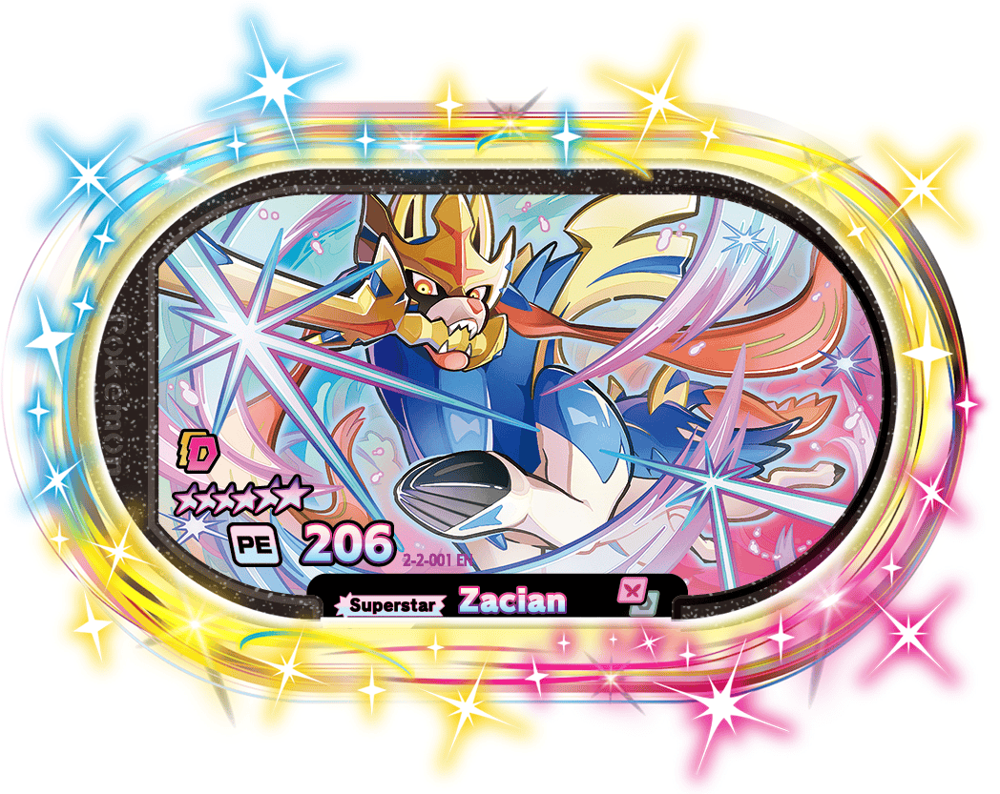

# Pokemon MEZASTAR Dex

Complete database of every international **Meza Tag** for the Pokemon MEZASTAR arcade game (Takara Tomy A.R.T.S / Marvelous).

**435 tags · 6 versions · full artwork · stats · rarity tiers**

## Versions covered

| Version | Tags | Codename |
|---|---|---|
| Galaxy V2 (current) | 73 | 2-2-XXX |
| Galaxy V1 | 73 | 2-1-XXX |
| Stardust V4 | 73 | 1-4-XXX |
| Stardust V3 | 73 | 1-3-XXX |
| Stardust V2 | 73 | 1-2-XXX |
| Stardust V1 | 70 | 1-1-XXX |

## Rarity structure (per set)

| Tier | Count | Look |
|---|---|---|
| 6-star Superstar | 10 | Rainbow lame, the chase cards |
| 5-star Star | 15 | Holofoil landscape art |
| 2-4 star | 45 | Standard pool |
| Regular reprints | 3 | Series-wide (G-Max Pikachu / Charizard / Gengar in Galaxy) |

## Data files

- `data/mezastar_tagdb.json` - master database (version, id, name, tier, rarity, types, ability, pe, image path)
- `data/mezastar_tags_all.csv` - same data, Excel-friendly (UTF-8 BOM)
- `data/collection_stats.json` - one player's collection sample with per-tag stats
- `images/<Version>/<id>_<Name>.png` - 435 official tag artworks

## Field glossary

- **PE** = Poke Energy, the tag's power rating (higher = stronger base attack)
- **ability** = special trigger: Double Move / Gigantamax / Dynamax / Mega Evolution / Z-Move / Chain Tag
- **tier** = rarity group as printed on the official site

## Game facts

- Vietnam machines launched 2026-05-29; the current international series is Galaxy (V1, V2)
- One Dynamax, one Mega Evolution and one Z-Move per battle session max
- Co-op Tag Battle: if both players catch the boss, BOTH get the tag
- Official drop rates are not published; community consensus: chase 6-star via co-op battles, skip catch attempts on 2-4 star

## Sources

- [Official site](https://world.pokemonmezastar.com/) (tag lists + artwork)
- [HoloHoard](https://holohoard.app/explore/game/pokemon-mezastar) (per-tag types / abilities / PE)

Pokemon and Pokemon MEZASTAR are trademarks of Nintendo / Creatures Inc. / GAME FREAK inc.
This is an unofficial fan project for personal collection tracking.
